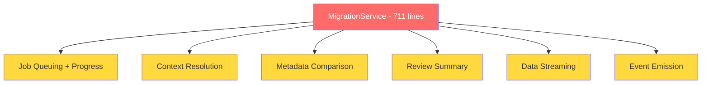

# 🔍 Data Explorer — Code Review Report

**Phiên bản**: 3.4.0 | **Ngày review**: 2026-05-07

---

## 📊 Top File lớn nhất & Phức tạp nhất

| # | File | Dòng | Vấn đề chính |
|---|------|------|-------------|
| 1 | `client/.../Query/QueryEditor.tsx` | **801** | God Component, 15+ useState, quá nhiều trách nhiệm |
| 2 | `server/.../migration/migration.service.ts` | **711** | God Class, 7+ interface riêng trong 1 file |
| 3 | `client/.../DataGrid/DataGrid.tsx` | **565** | Inline JSX phức tạp, logic rendering lồng nhau |
| 4 | `server/.../database-strategies/mongodb.strategy.ts` | **532** | Logic tạo URI phức tạp, any type |
| 5 | `server/.../query/query.service.ts` | **525** | DRY violation, try/catch lặp lại 7 lần |
| 6 | `server/.../connections/connections.service.ts` | **516** | SRP violation, var keyword, pool logic trùng lặp |
| 7 | `server/.../database-strategies/postgres.strategy.ts` | **493** | Magic numbers, any type |
| 8 | `client/.../Query/AiAssistant.tsx` | **453** | Hardcoded config, inline JSX dài |

---

## 🏛️ OOP Principles

### ✅ Làm tốt

- **Strategy Pattern** cho database strategies — [`IDatabaseStrategy`](server/src/database-strategies/database-strategy.interface.ts:89) interface với `PostgresStrategy`, `MongoDbStrategy`, `MssqlStrategy`, `ClickHouseStrategy`, v.v. Đây là OOP chuẩn.
- **Dependency Injection** của NestJS xuyên suốt server — các service inject nhau qua constructor.
- **Clean separation** entities/DTOs/services/controllers theo chuẩn NestJS modular.
- **Zustand slice pattern** trên client — [`AppState`](client/src/core/services/store/index.ts:16) được chia thành 7 slice riêng biệt.

### ❌ Cần cải thiện

| Vấn đề | File | Chi tiết |
|--------|------|----------|
| **God Class** | [`MigrationService`](server/src/migration/migration.service.ts:120) | 711 dòng, làm quá nhiều việc: job queuing, progress tracking, context resolution, metadata comparison, review summary, data streaming, event emission |
| **God Class** | [`ConnectionsService`](server/src/connections/connections.service.ts:14) | 516 dòng: CRUD, pool management, SSH tunnels, health checks, organization membership |
| **God Component** | [`QueryEditor`](client/src/presentation/modules/Query/QueryEditor.tsx:46) | 801 dòng, 15+ useState, xử lý query execution, saving, dashboard, keyboard shortcuts, explain plans |
| **`any` type lạm dụng** | Nhiều file | `pool: any`, `params: any`, `connection: any`, `result: any` — phá vỡ type safety |
| **`var` keyword** | [`connections.service.ts:267-269`](server/src/connections/connections.service.ts:267) | Dùng `var` thay vì `const`/`let` |
| **Unnecessary Facade** | [`AiService`](server/src/ai/ai.service.ts:7) | Chỉ delegate sang sub-service mà không thêm logic — tạo indirection không cần thiết |

---

## 📐 SOLID Principles

### S — Single Responsibility Principle ⚠️ Nhiều vi phạm



**Vi phạm chính:**

1. **[`MigrationService`](server/src/migration/migration.service.ts:120)** — Nên tách thành:
   - `MigrationJobService` — job queuing, progress, ownership
   - `MigrationComparisonService` — column/index diff, compatibility checks
   - `MigrationExecutionService` — context resolution, data streaming

2. **[`ConnectionsService`](server/src/connections/connections.service.ts:14)** — Nên tách thành:
   - `ConnectionCrudService` — create, update, remove, findOne
   - `ConnectionPoolService` — pool management, cleanup, getPool
   - `ConnectionHealthService` — checkHealth, updateHealthState

3. **[`QueryService`](server/src/query/query.service.ts:30)** — Nên tách thành:
   - `QueryExecutionService` — executeQuery, assertQueryAllowed
   - `SchemaOperationService` — updateSchema, createDatabase, dropDatabase
   - `DataImportService` — importData, seedData

4. **[`QueryEditor.tsx`](client/src/presentation/modules/Query/QueryEditor.tsx:46)** — Nên extract thêm hooks:
   - `useQuerySave()` — đã có một phần nhưng logic save vẫn còn trong component
   - `useQueryDashboard()` — dashboard dialog logic
   - `useQueryExplain()` — explain plan logic

### O — Open/Closed Principle ✅ Tốt / ⚠️ Một số vấn đề

**Tốt:**
- Database Strategy Pattern — thêm engine mới chỉ cần implement [`IDatabaseStrategy`](server/src/database-strategies/database-strategy.interface.ts:89)
- AI Provider Routing — thêm provider mới không cần sửa code hiện tại

**Vấn đề:**
- [`pingPool()`](server/src/connections/connections.service.ts:75) dùng switch trên type — nên là method của strategy
- `isMongoLike()` check rải rác trong [`MigrationService`](server/src/migration/migration.service.ts:226) — nên encapsulate trong strategy

### L — Liskov Substitution Principle ⚠️ Vi phạm

- [`IDatabaseStrategy.createPool()`](server/src/database-strategies/database-strategy.interface.ts:90) trả về `Promise<unknown> | unknown` — inconsistent, không thể substitute an toàn
- MongoDB strategy's [`executeQuery()`](server/src/database-strategies/mongodb.strategy.ts:94) nhận JSON string thay vì SQL — contract khác hoàn toàn so với SQL strategies, nhưng vẫn dùng chung interface

### I — Interface Segregation Principle ⚠️ Vi phạm

- [`IDatabaseStrategy`](server/src/database-strategies/database-strategy.interface.ts:89) là **fat interface** — không phải strategy nào cũng cần `updateRow`, `insertRow`, `deleteRows`, `buildAlterTableSql`, `seedData`, `createDatabase`, `dropDatabase`. Nên tách thành:
  - `IReadableStrategy` — query, metadata
  - `IWritableStrategy` — CRUD operations
  - `ISchemaStrategy` — DDL operations
  - `IPoolStrategy` — pool lifecycle

### D — Dependency Inversion Principle ✅ Tốt / ⚠️ Một số vấn đề

**Tốt:**
- NestJS DI xuyên suốt
- Strategy Factory pattern

**Vấn đề:**
- [`QueryService`](server/src/query/query.service.ts:30) phụ thuộc trực tiếp `ConnectionsService` cho pool — nên depend on abstraction
- Client-side services như `connectionService`, `SavedQueryService`, `DashboardService` import trực tiếp singleton thay vì inject

---

## 🎯 YAGNI Analysis

| Vấn đề | File | Dòng | Chi tiết |
|--------|------|------|----------|
| **Dead code** | [`AiService.parseAiResponse()`](server/src/ai/ai.service.ts:55) | 55-57 | Method chỉ return input — không có logic, không được dùng có ý nghĩa |
| **Dead code** | [`MigrationService.completeJob()`](server/src/migration/migration.service.ts:222) | 222-224 | Method rỗng, chỉ có comment |
| **Dead code** | [`QueryEditor.tsx useEffect`](client/src/presentation/modules/Query/QueryEditor.tsx:475) | 475-479 | useEffect với body rỗng — không làm gì |
| **Over-engineering** | [`MigrationStream`](server/src/migration/migration.service.ts:50) | 50-55 | Custom AsyncIterable interface có thể không cần thiết |
| **Hardcoded workaround** | [`DataGrid.tsx`](client/src/presentation/modules/DataGrid/DataGrid.tsx:63) | 63 | `isLargeDataset` check với hardcoded IDs |

---

## 🧠 KISS Analysis

| Vấn đề | File | Chi tiết |
|--------|------|----------|
| **Unnecessary Facade** | [`AiService`](server/src/ai/ai.service.ts:7) | Chỉ delegate sang sub-services. Consumer nên inject trực tiếp service cần thiết. |
| **Complex branching** | [`ConnectionsService.getPool()`](server/src/connections/connections.service.ts:262) | Logic phức tạp với `var`, fallback, SSH tunnel branching — 60 dòng trong 1 method |
| **Quá nhiều state** | [`QueryEditor.tsx`](client/src/presentation/modules/Query/QueryEditor.tsx:46) | 15+ useState calls — component khó hiểu và maintain |
| **Hardcoded config** | [`AiAssistant.tsx`](client/src/presentation/modules/Query/AiAssistant.tsx:57) | MODELS, MODES, ROUTING_MODES hardcoded trong component — nên là config file |
| **Inline count logic** | [`QueryService.executeQuery()`](server/src/query/query.service.ts:277) | Logic đếm total rows inline 20 dòng — nên extract thành method riêng |

---

## 🔁 DRY Analysis

### Vi phạm nghiêm trọng

**1. Pool close logic trùng lặp 4 lần trong [`ConnectionsService`](server/src/connections/connections.service.ts):**

```
cleanupPools()     → dòng 95-117
onModuleDestroy()  → dòng 119-129
removePool()       → dòng 435-456
remove()           → dòng 412-433
```

Tất cả đều có pattern: iterate pools → get strategy → closePool → delete. Nên extract thành `closePoolByKey()`.

**2. Error handling pattern lặp lại 7 lần trong [`QueryService`](server/src/query/query.service.ts):**

```typescript
// Lặp lại trong: updateRow, insertRow, deleteRows, seedData, 
// createDatabase, dropDatabase, importData
} catch (error) {
    this.logger.error('XXX Error:', error instanceof Error ? error.message : String(error));
    throw new InternalServerErrorException(`XXX failed: ${error instanceof Error ? error.message : String(error)}`);
}
```

Nên extract thành `handleQueryError(operation, error)` utility.

**3. Double type cast `as unknown as Connection`** — xuất hiện nhiều lần trong [`ConnectionsService`](server/src/connections/connections.service.ts).

**4. `addQueryHistory` calls** — lặp lại pattern trong [`QueryEditor.tsx`](client/src/presentation/modules/Query/QueryEditor.tsx) cho success và error cases.

**5. MongoDB type check** — `type === 'mongodb' || type === 'mongodb+srv'` lặp lại ở:
- [`query.service.ts`](server/src/query/query.service.ts:155)
- [`query.service.ts`](server/src/query/query.service.ts:169)
- [`migration.service.ts`](server/src/migration/migration.service.ts:226)
- [`connections.service.ts`](server/src/connections/connections.service.ts:87)

Nên tạo utility `isMongoType(type: string): boolean`.

**6. Error message extraction** — `error instanceof Error ? error.message : String(error)` lặp lại khắp nơi. Nên có `getErrorMessage(error: unknown): string` utility.

---

## 📦 Nesting Depth Analysis

### 🔴 Deep Nesting (cần refactor)

**1. [`QueryService.assertQueryAllowed()`](server/src/query/query.service.ts:136) — 5 levels:**
```
function assertQueryAllowed()
  ├─ if !allowQueryExecution          → level 1
  │   └─ await blockOperation()       → level 2
  ├─ if !isMongo                      → level 1
  │   └─ if containsMultipleStatements → level 2
  │       └─ await blockOperation()    → level 3
  ├─ if isMongo                       → level 1
  │   └─ if readOnly                  → level 2
  │       └─ if !isAllowed            → level 3
  │           └─ await blockOperation() → level 4
  ├─ if readOnly && !isAllowed        → level 1
  │   └─ await blockOperation()       → level 2
  └─ if !readOnly                     → level 1
      └─ if isDestructive && !confirmed → level 2
          └─ await auditService.log()  → level 3
              └─ throw ForbiddenException → level 4
```

**Nên refactor thành early-return pattern hoặc chain of responsibility.**

**2. [`MigrationService.resolveMigrationContext()`](server/src/migration/migration.service.ts:309) — 4-5 levels** với conditional stage marking.

**3. [`ConnectionsService.getPool()`](server/src/connections/connections.service.ts:262) — 4-5 levels** với SSH tunnel branching.

**4. [`AiAssistant.tsx`](client/src/presentation/modules/Query/AiAssistant.tsx) JSX — 6+ levels** của div lồng nhau với conditional rendering.

**5. [`DataGrid.tsx`](client/src/presentation/modules/DataGrid/DataGrid.tsx) column rendering — inline functions** với nested conditionals trong cell renderer.

---

## 🧹 Clean Code Analysis

### ❌ Vấn đề cần sửa

| # | Vấn đề | Ví dụ | Đề xuất |
|---|--------|-------|---------|
| 1 | **`any` type abuse** | `pool: any`, `params: any`, `connection: any` | Dùng generic types hoặc specific interfaces |
| 2 | **`var` keyword** | [`connections.service.ts:267-269`](server/src/connections/connections.service.ts:267) | Đổi thành `const`/`let` |
| 3 | **Magic numbers** | `50000`, `30000`, `60000`, `3600000` | Tạo named constants |
| 4 | **Hardcoded i18n strings** | Vietnamese strings mixed trong [`AiAssistant.tsx`](client/src/presentation/modules/Query/AiAssistant.tsx) | Dùng i18n system nhất quán |
| 5 | **console.log/error** | [`QueryEditor.tsx:325`](client/src/presentation/modules/Query/QueryEditor.tsx:325), [`QueryEditor.tsx:400`](client/src/presentation/modules/Query/QueryEditor.tsx:400) | Dùng logger service |
| 6 | **Dead code** | [`parseAiResponse()`](server/src/ai/ai.service.ts:55), [`completeJob()`](server/src/migration/migration.service.ts:222), empty useEffect | Xóa bỏ |
| 7 | **Double type cast** | `as unknown as Connection` nhiều lần | Fix type definitions |
| 8 | **Large inline JSX** | [`AiAssistant.tsx`](client/src/presentation/modules/Query/AiAssistant.tsx) 200+ dòng JSX inline | Tách thành sub-components |
| 9 | **Inconsistent error handling** | Mix of try/catch patterns | Uniform error handling utility |
| 10 | **Interface trong file service** | 7 interfaces trong [`migration.service.ts`](server/src/migration/migration.service.ts:9) | Tách vào file types riêng |

---

## 📋 Action Plan — Ưu tiên cải thiện

### 🔴 Priority 1 — High Impact

- [ ] **Tách `MigrationService`** thành 3 service: JobService, ComparisonService, ExecutionService
- [ ] **Tách `QueryEditor.tsx`** — extract hooks: `useQuerySave`, `useQueryDashboard`, `useQueryExplain`
- [ ] **Tạo error handling utility** — `handleQueryError()`, `getErrorMessage()` để DRY
- [ ] **Tạo pool close utility** trong ConnectionsService — `closePoolByKey()`
- [ ] **Xóa dead code** — `parseAiResponse()`, `completeJob()`, empty useEffect

### 🟡 Priority 2 — Medium Impact

- [ ] **Tách `ConnectionsService`** thành CrudService, PoolService, HealthService
- [ ] **Tách `QueryService`** thành ExecutionService, SchemaService, ImportService
- [ ] **Refactor `IDatabaseStrategy`** thành ISP-compliant interfaces: IReadable, IWritable, ISchema
- [ ] **Extract hardcoded config** từ AiAssistant.tsx vào config file
- [ ] **Fix `any` types** — thay bằng proper generic types
- [ ] **Fix `var` keyword** trong connections.service.ts
- [ ] **Tạo `isMongoType()` utility** để DRY

### 🟢 Priority 3 — Low Impact

- [ ] **Replace magic numbers** bằng named constants
- [ ] **Unify i18n** — bỏ hardcoded Vietnamese strings
- [ ] **Replace console.log** bằng logger service
- [ ] **Fix double type cast** `as unknown as Connection`
- [ ] **Tách interfaces** từ migration.service.ts vào types file riêng
- [ ] **Refactor deep nesting** trong assertQueryAllowed() thành early-return pattern
- [ ] **Move `pingPool()`** vào IDatabaseStrategy interface

---

## 📈 Điểm tổng quan

| Nguyên tắc | Điểm | Nhận xét |
|------------|------|----------|
| **OOP** | 7/10 | Strategy pattern tốt, nhưng God Class kéo xuống |
| **SRP** | 4/10 | Nhiều service/component làm quá nhiều việc |
| **OCP** | 8/10 | Strategy pattern cho DB và AI routing rất tốt |
| **LSP** | 6/10 | MongoDB strategy khác contract nhưng chung interface |
| **ISP** | 5/10 | IDatabaseStrategy là fat interface |
| **DIP** | 7/10 | NestJS DI tốt, client-side chưa inject |
| **YAGNI** | 7/10 | Ít dead code, một số over-engineering |
| **KISS** | 5/10 | God Class, quá nhiều state, logic phức tạp |
| **DRY** | 4/10 | Nhiều pattern lặp lại, đặc biệt error handling |
| **Clean Code** | 5/10 | any types, magic numbers, hardcoded strings |
| **Nesting** | 5/10 | Một số function 4-5 levels deep |

**Tổng: 5.7/10** — Kiến trúc nền tảng tốt (Strategy Pattern, DI, Modular), nhưng cần refactor God Class/Component và DRY violations để cải thiện đáng kể.
