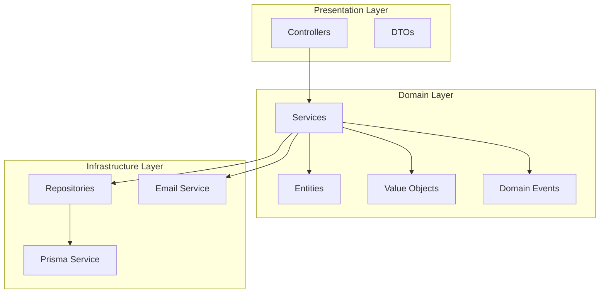

# Phase 1 Implementation Plan - Team Collaboration Features

## Overview

This document provides a detailed implementation plan for Phase 1 (Foundation) of team collaboration features in Data Explorer, following **OOP, SOLID, Clean Code, KISS, YAGNI, DRY, and proper nesting** principles.

---

## Design Principles Applied

### SOLID Principles

| Principle | Application |
|-----------|-------------|
| **S** - Single Responsibility | Each service/class has one reason to change |
| **O** - Open/Closed | Open for extension, closed for modification |
| **L** - Liskov Substitution | Subtypes must be substitutable for base types |
| **I** - Interface Segregation | Clients depend only on interfaces they use |
| **D** - Dependency Inversion | Depend on abstractions, not concretions |

### Clean Code Principles

- **Meaningful names**: Variables, functions, classes express intent
- **Small functions**: Each function does one thing well
- **DRY**: Don't Repeat Yourself - extract common logic
- **KISS**: Keep It Simple, Stupid - avoid over-engineering
- **YAGNI**: You Aren't Gonna Need It - implement only what's needed now
- **Proper nesting**: Maximum 3 levels of nesting, use early returns

---

## Architecture Overview



---

## Module Structure

```
server/src/
├── organizations/
│   ├── dto/
│   │   ├── create-organization.dto.ts
│   │   ├── update-organization.dto.ts
│   │   ├── invite-member.dto.ts
│   │   └── update-member-role.dto.ts
│   ├── entities/
│   │   ├── organization.entity.ts
│   │   ├── organization-member.entity.ts
│   │   └── organization-role.enum.ts
│   ├── interfaces/
│   │   ├── organizations.repository.interface.ts
│   │   └── invitations.service.interface.ts
│   ├── repositories/
│   │   └── organizations.repository.ts
│   ├── services/
│   │   ├── organizations.service.ts
│   │   ├── invitations.service.ts
│   │   └── permissions.service.ts
│   ├── organizations.controller.ts
│   └── organizations.module.ts
├── permissions/
│   ├── decorators/
│   │   ├── require-permission.decorator.ts
│   │   └── require-role.decorator.ts
│   ├── guards/
│   │   ├── permission.guard.ts
│   │   └── role.guard.ts
│   ├── enums/
│   │   ├── permission.enum.ts
│   │   └── resource-type.enum.ts
│   ├── interfaces/
│   │   └── permissions.service.interface.ts
│   ├── services/
│   │   └── permissions.service.ts
│   └── permissions.module.ts
└── shared/
    ├── decorators/
    │   └── current-user.decorator.ts
    ├── exceptions/
    │   ├── forbidden.exception.ts
    │   └── not-found.exception.ts
    └── utils/
        ├── permission.util.ts
        └── validation.util.ts
```

---

## Database Schema (Prisma)

```prisma
// Enums
enum OrganizationRole {
  OWNER
  ADMIN
  MEMBER
  VIEWER
}

enum Permission {
  READ
  WRITE
  DELETE
  MANAGE
}

enum ResourceType {
  CONNECTION
  QUERY
  DASHBOARD
  ERD
}

// Models
model Organization {
  id          String   @id @default(uuid())
  name        String
  slug        String   @unique
  logoUrl     String?
  settings    Json?
  createdAt   DateTime @default(now())
  updatedAt   DateTime @updatedAt

  members     OrganizationMember[]
  resources   OrganizationResource[]
}

model OrganizationMember {
  id             String            @id @default(uuid())
  role           OrganizationRole  @default(MEMBER)
  invitedBy      String?
  invitedAt      DateTime          @default(now())
  joinedAt       DateTime?

  organizationId String
  organization   Organization      @relation(fields: [organizationId], references: [id], onDelete: Cascade)

  userId         String
  user           User              @relation(fields: [userId], references: [id], onDelete: Cascade)

  @@unique([organizationId, userId])
  @@index([organizationId])
  @@index([userId])
}

model OrganizationResource {
  id             String       @id @default(uuid())
  resourceType   ResourceType
  resourceId     String
  permissions    Json         // { read: boolean, write: boolean, delete: boolean }
  createdAt      DateTime     @default(now())

  organizationId String
  organization   Organization @relation(fields: [organizationId], references: [id], onDelete: Cascade)

  @@unique([resourceType, resourceId, organizationId])
  @@index([organizationId])
  @@index([resourceType, resourceId])
}
```

---

## Core Interfaces

### 1. Repository Interface (Dependency Inversion)

```typescript
// server/src/organizations/interfaces/organizations.repository.interface.ts
import { Organization, OrganizationMember, Prisma } from '@prisma/client';

export interface IOrganizationsRepository {
  // Organization CRUD
  findById(id: string): Promise<Organization | null>;
  findBySlug(slug: string): Promise<Organization | null>;
  create(data: Prisma.OrganizationCreateInput): Promise<Organization>;
  update(id: string, data: Prisma.OrganizationUpdateInput): Promise<Organization>;
  delete(id: string): Promise<void>;
  
  // Member management
  findMember(organizationId: string, userId: string): Promise<OrganizationMember | null>;
  findMembers(organizationId: string): Promise<OrganizationMember[]>;
  addMember(data: Prisma.OrganizationMemberCreateInput): Promise<OrganizationMember>;
  updateMemberRole(organizationId: string, userId: string, role: string): Promise<OrganizationMember>;
  removeMember(organizationId: string, userId: string): Promise<void>;
  
  // Resource management
  findResource(resourceType: string, resourceId: string, organizationId: string): Promise<any>;
  addResource(data: Prisma.OrganizationResourceCreateInput): Promise<any>;
  removeResource(resourceType: string, resourceId: string, organizationId: string): Promise<void>;
}
```

### 2. Service Interface (Interface Segregation)

```typescript
// server/src/organizations/interfaces/invitations.service.interface.ts
export interface IInvitationsService {
  sendInvitation(organizationId: string, email: string, inviterId: string): Promise<void>;
  acceptInvitation(token: string, userId: string): Promise<void>;
  declineInvitation(token: string): Promise<void>;
  cancelInvitation(organizationId: string, invitationId: string): Promise<void>;
  listPendingInvitations(organizationId: string): Promise<Invitation[]>;
}
```

---

## Implementation Details

### 1. Organizations Service (Single Responsibility)

```typescript
// server/src/organizations/services/organizations.service.ts
import { Injectable, NotFoundException, ForbiddenException } from '@nestjs/common';
import { PrismaService } from '../../prisma/prisma.service';
import { IOrganizationsRepository } from '../interfaces/organizations.repository.interface';
import { OrganizationsRepository } from '../repositories/organizations.repository';
import { CreateOrganizationDto } from '../dto/create-organization.dto';
import { UpdateOrganizationDto } from '../dto/update-organization.dto';
import { OrganizationRole } from '../entities/organization-role.enum';
import { AuditService } from '../../audit/audit.service';

@Injectable()
export class OrganizationsService {
  private readonly repository: IOrganizationsRepository;

  constructor(
    private readonly prisma: PrismaService,
    private readonly auditService: AuditService,
  ) {
    this.repository = new OrganizationsRepository(prisma);
  }

  async create(userId: string, dto: CreateOrganizationDto): Promise<OrganizationEntity> {
    const slug = this.generateSlug(dto.name);
    
    const organization = await this.repository.create({
      name: dto.name,
      slug,
      settings: dto.settings || {},
    });

    await this.repository.addMember({
      organizationId: organization.id,
      userId,
      role: OrganizationRole.OWNER,
      joinedAt: new Date(),
    });

    await this.auditService.log({
      action: 'organization.created',
      userId,
      details: { organizationId: organization.id },
    });

    return this.toEntity(organization, userId);
  }

  async findById(id: string, userId: string): Promise<OrganizationEntity> {
    const organization = await this.repository.findById(id);
    
    if (!organization) {
      throw new NotFoundException('Organization not found');
    }

    await this.ensureMemberAccess(organization.id, userId);

    return this.toEntity(organization, userId);
  }

  async update(id: string, userId: string, dto: UpdateOrganizationDto): Promise<OrganizationEntity> {
    await this.ensureOwnerOrAdminAccess(id, userId);

    const organization = await this.repository.update(id, dto);

    await this.auditService.log({
      action: 'organization.updated',
      userId,
      details: { organizationId: id },
    });

    return this.toEntity(organization, userId);
  }

  async delete(id: string, userId: string): Promise<void> {
    await this.ensureOwnerAccess(id, userId);

    await this.repository.delete(id);

    await this.auditService.log({
      action: 'organization.deleted',
      userId,
      details: { organizationId: id },
    });
  }

  // Private helper methods (Single Responsibility)
  private generateSlug(name: string): string {
    return name
      .toLowerCase()
      .replace(/[^a-z0-9]+/g, '-')
      .replace(/(^-|-$)/g, '');
  }

  private async ensureMemberAccess(organizationId: string, userId: string): Promise<void> {
    const member = await this.repository.findMember(organizationId, userId);
    
    if (!member) {
      throw new ForbiddenException('You are not a member of this organization');
    }
  }

  private async ensureOwnerOrAdminAccess(organizationId: string, userId: string): Promise<void> {
    const member = await this.repository.findMember(organizationId, userId);
    
    if (!member) {
      throw new ForbiddenException('You are not a member of this organization');
    }

    if (member.role !== OrganizationRole.OWNER && member.role !== OrganizationRole.ADMIN) {
      throw new ForbiddenException('Only owners and admins can perform this action');
    }
  }

  private async ensureOwnerAccess(organizationId: string, userId: string): Promise<void> {
    const member = await this.repository.findMember(organizationId, userId);
    
    if (!member || member.role !== OrganizationRole.OWNER) {
      throw new ForbiddenException('Only owners can perform this action');
    }
  }

  private toEntity(organization: any, currentUserId: string): OrganizationEntity {
    return {
      id: organization.id,
      name: organization.name,
      slug: organization.slug,
      logoUrl: organization.logoUrl,
      settings: organization.settings,
      createdAt: organization.createdAt,
      updatedAt: organization.updatedAt,
      memberCount: organization.members?.length || 0,
      currentUserRole: organization.members?.find((m: any) => m.userId === currentUserId)?.role,
    };
  }
}
```

### 2. Permissions Service (Open/Closed Principle)

```typescript
// server/src/permissions/services/permissions.service.ts
import { Injectable, ForbiddenException } from '@nestjs/common';
import { Permission, ResourceType } from '../enums';
import { IOrganizationsRepository } from '../../organizations/interfaces/organizations.repository.interface';

// Strategy pattern for permission checking
interface IPermissionStrategy {
  check(permissions: Record<string, boolean>): boolean;
}

class ReadPermissionStrategy implements IPermissionStrategy {
  check(permissions: Record<string, boolean>): boolean {
    return permissions.read === true;
  }
}

class WritePermissionStrategy implements IPermissionStrategy {
  check(permissions: Record<string, boolean>): boolean {
    return permissions.write === true;
  }
}

class DeletePermissionStrategy implements IPermissionStrategy {
  check(permissions: Record<string, boolean>): boolean {
    return permissions.delete === true;
  }
}

class ManagePermissionStrategy implements IPermissionStrategy {
  check(permissions: Record<string, boolean>): boolean {
    return permissions.manage === true;
  }
}

@Injectable()
export class PermissionsService {
  private readonly strategies: Map<Permission, IPermissionStrategy>;

  constructor(private readonly repository: IOrganizationsRepository) {
    this.strategies = new Map([
      [Permission.READ, new ReadPermissionStrategy()],
      [Permission.WRITE, new WritePermissionStrategy()],
      [Permission.DELETE, new DeletePermissionStrategy()],
      [Permission.MANAGE, new ManagePermissionStrategy()],
    ]);
  }

  async checkPermission(
    userId: string,
    resourceType: ResourceType,
    resourceId: string,
    permission: Permission,
  ): Promise<boolean> {
    const resource = await this.repository.findResource(
      resourceType,
      resourceId,
      userId,
    );

    if (!resource) {
      return false;
    }

    const strategy = this.strategies.get(permission);
    
    if (!strategy) {
      throw new Error(`Unknown permission: ${permission}`);
    }

    return strategy.check(resource.permissions);
  }

  async ensurePermission(
    userId: string,
    resourceType: ResourceType,
    resourceId: string,
    permission: Permission,
  ): Promise<void> {
    const hasPermission = await this.checkPermission(
      userId,
      resourceType,
      resourceId,
      permission,
    );

    if (!hasPermission) {
      throw new ForbiddenException(
        `You do not have ${permission} permission for this ${resourceType}`,
      );
    }
  }

  // Open/Closed: Easy to add new permissions without modifying existing code
  addPermissionStrategy(permission: Permission, strategy: IPermissionStrategy): void {
    this.strategies.set(permission, strategy);
  }
}
```

### 3. Repository Implementation (DRY Principle)

```typescript
// server/src/organizations/repositories/organizations.repository.ts
import { Injectable } from '@nestjs/common';
import { PrismaService } from '../../prisma/prisma.service';
import { IOrganizationsRepository } from '../interfaces/organizations.repository.interface';

@Injectable()
export class OrganizationsRepository implements IOrganizationsRepository {
  constructor(private readonly prisma: PrismaService) {}

  async findById(id: string) {
    return this.prisma.organization.findUnique({
      where: { id },
      include: { members: true },
    });
  }

  async findBySlug(slug: string) {
    return this.prisma.organization.findUnique({
      where: { slug },
      include: { members: true },
    });
  }

  async create(data: any) {
    return this.prisma.organization.create({
      data,
      include: { members: true },
    });
  }

  async update(id: string, data: any) {
    return this.prisma.organization.update({
      where: { id },
      data,
      include: { members: true },
    });
  }

  async delete(id: string) {
    await this.prisma.organization.delete({
      where: { id },
    });
  }

  async findMember(organizationId: string, userId: string) {
    return this.prisma.organizationMember.findUnique({
      where: {
        organizationId_userId: {
          organizationId,
          userId,
        },
      },
    });
  }

  async findMembers(organizationId: string) {
    return this.prisma.organizationMember.findMany({
      where: { organizationId },
      include: { user: true },
      orderBy: { joinedAt: 'asc' },
    });
  }

  async addMember(data: any) {
    return this.prisma.organizationMember.create({
      data,
      include: { user: true },
    });
  }

  async updateMemberRole(organizationId: string, userId: string, role: string) {
    return this.prisma.organizationMember.update({
      where: {
        organizationId_userId: {
          organizationId,
          userId,
        },
      },
      data: { role },
      include: { user: true },
    });
  }

  async removeMember(organizationId: string, userId: string) {
    await this.prisma.organizationMember.delete({
      where: {
        organizationId_userId: {
          organizationId,
          userId,
        },
      },
    });
  }

  async findResource(resourceType: string, resourceId: string, organizationId: string) {
    return this.prisma.organizationResource.findUnique({
      where: {
        resourceType_resourceId_organizationId: {
          resourceType,
          resourceId,
          organizationId,
        },
      },
    });
  }

  async addResource(data: any) {
    return this.prisma.organizationResource.create({
      data,
    });
  }

  async removeResource(resourceType: string, resourceId: string, organizationId: string) {
    await this.prisma.organizationResource.delete({
      where: {
        resourceType_resourceId_organizationId: {
          resourceType,
          resourceId,
          organizationId,
        },
      },
    });
  }
}
```

### 4. Guards (Single Responsibility + DRY)

```typescript
// server/src/permissions/guards/permission.guard.ts
import { Injectable, CanActivate, ExecutionContext } from '@nestjs/common';
import { Reflector } from '@nestjs/core';
import { PERMISSION_KEY } from '../decorators/require-permission.decorator';
import { PermissionsService } from '../services/permissions.service';

@Injectable()
export class PermissionGuard implements CanActivate {
  constructor(
    private readonly reflector: Reflector,
    private readonly permissionsService: PermissionsService,
  ) {}

  async canActivate(context: ExecutionContext): Promise<boolean> {
    const requiredPermissions = this.reflector.getAllAndOverride(PERMISSION_KEY, [
      context.getHandler(),
      context.getClass(),
    ]);

    if (!requiredPermissions) {
      return true;
    }

    const request = context.switchToHttp().getRequest();
    const userId = request.user?.id;

    if (!userId) {
      return false;
    }

    const { resourceType, resourceId, permission } = requiredPermissions;

    await this.permissionsService.ensurePermission(
      userId,
      resourceType,
      resourceId,
      permission,
    );

    return true;
  }
}
```

### 5. Decorators (KISS Principle)

```typescript
// server/src/permissions/decorators/require-permission.decorator.ts
import { SetMetadata } from '@nestjs/common';
import { Permission, ResourceType } from '../enums';

export const PERMISSION_KEY = 'permission';

export const RequirePermission = (
  resourceType: ResourceType,
  permission: Permission,
) => {
  return (target: any, propertyKey: string, descriptor: PropertyDescriptor) => {
    SetMetadata(PERMISSION_KEY, {
      resourceType,
      permission,
      getResourceId: (request: any) => request.params.id || request.body.resourceId,
    });
  };
};
```

### 6. Controller (Clean Code + Proper Nesting)

```typescript
// server/src/organizations/organizations.controller.ts
import {
  Controller,
  Get,
  Post,
  Put,
  Delete,
  Body,
  Param,
  UseGuards,
  HttpCode,
  HttpStatus,
} from '@nestjs/common';
import { OrganizationsService } from './services/organizations.service';
import { CreateOrganizationDto } from './dto/create-organization.dto';
import { UpdateOrganizationDto } from './dto/update-organization.dto';
import { InviteMemberDto } from './dto/invite-member.dto';
import { UpdateMemberRoleDto } from './dto/update-member-role.dto';
import { JwtAuthGuard } from '../../auth/guards/jwt-auth.guard';
import { CurrentUser } from '../../shared/decorators/current-user.decorator';

@Controller('organizations')
@UseGuards(JwtAuthGuard)
export class OrganizationsController {
  constructor(private readonly organizationsService: OrganizationsService) {}

  @Post()
  @HttpCode(HttpStatus.CREATED)
  async create(
    @CurrentUser('id') userId: string,
    @Body() dto: CreateOrganizationDto,
  ) {
    return this.organizationsService.create(userId, dto);
  }

  @Get(':id')
  async findOne(
    @CurrentUser('id') userId: string,
    @Param('id') id: string,
  ) {
    return this.organizationsService.findById(id, userId);
  }

  @Put(':id')
  async update(
    @CurrentUser('id') userId: string,
    @Param('id') id: string,
    @Body() dto: UpdateOrganizationDto,
  ) {
    return this.organizationsService.update(id, userId, dto);
  }

  @Delete(':id')
  @HttpCode(HttpStatus.NO_CONTENT)
  async delete(
    @CurrentUser('id') userId: string,
    @Param('id') id: string,
  ) {
    await this.organizationsService.delete(id, userId);
  }

  @Post(':id/members')
  @HttpCode(HttpStatus.CREATED)
  async inviteMember(
    @CurrentUser('id') userId: string,
    @Param('id') organizationId: string,
    @Body() dto: InviteMemberDto,
  ) {
    return this.organizationsService.inviteMember(organizationId, userId, dto);
  }

  @Put(':id/members/:userId')
  async updateMemberRole(
    @CurrentUser('id') userId: string,
    @Param('id') organizationId: string,
    @Param('userId') targetUserId: string,
    @Body() dto: UpdateMemberRoleDto,
  ) {
    return this.organizationsService.updateMemberRole(
      organizationId,
      userId,
      targetUserId,
      dto.role,
    );
  }

  @Delete(':id/members/:userId')
  @HttpCode(HttpStatus.NO_CONTENT)
  async removeMember(
    @CurrentUser('id') userId: string,
    @Param('id') organizationId: string,
    @Param('userId') targetUserId: string,
  ) {
    await this.organizationsService.removeMember(
      organizationId,
      userId,
      targetUserId,
    );
  }

  @Get(':id/members')
  async listMembers(
    @CurrentUser('id') userId: string,
    @Param('id') organizationId: string,
  ) {
    return this.organizationsService.listMembers(organizationId, userId);
  }
}
```

---

## Code Quality Standards

### 1. Function Length (KISS)
- Maximum 20 lines per function
- Extract complex logic to separate methods
- Use descriptive function names

### 2. Nesting Level (Clean Code)
- Maximum 3 levels of nesting
- Use early returns to reduce nesting
- Extract nested logic to separate functions

### 3. Parameter Count (Clean Code)
- Maximum 3 parameters per function
- Use parameter objects for more parameters
- Consider builder pattern for complex objects

### 4. DRY Implementation
- Extract common validation logic
- Create reusable utility functions
- Use inheritance for shared behavior

### 5. YAGNI Principle
- Implement only what's needed for Phase 1
- Avoid over-engineering
- Keep interfaces minimal

---

## Testing Strategy

### Unit Tests
```typescript
// server/src/organizations/services/organizations.service.spec.ts
describe('OrganizationsService', () => {
  let service: OrganizationsService;
  let repository: jest.Mocked<IOrganizationsRepository>;

  beforeEach(() => {
    repository = createMockRepository();
    service = new OrganizationsService(mockPrisma, mockAuditService);
  });

  describe('create', () => {
    it('should create organization with owner', async () => {
      const dto = { name: 'Test Org' };
      const result = await service.create('user-1', dto);

      expect(repository.create).toHaveBeenCalled();
      expect(repository.addMember).toHaveBeenCalledWith({
        organizationId: result.id,
        userId: 'user-1',
        role: OrganizationRole.OWNER,
      });
    });

    it('should generate slug from name', async () => {
      const dto = { name: 'Test Organization' };
      const result = await service.create('user-1', dto);

      expect(result.slug).toBe('test-organization');
    });
  });

  describe('update', () => {
    it('should allow owner to update', async () => {
      const dto = { name: 'Updated Name' };
      
      await expect(
        service.update('org-1', 'owner-1', dto)
      ).resolves.toBeDefined();
    });

    it('should forbid non-owner from updating', async () => {
      const dto = { name: 'Updated Name' };
      
      await expect(
        service.update('org-1', 'member-1', dto)
      ).rejects.toThrow(ForbiddenException);
    });
  });
});
```

### Integration Tests
```typescript
// server/src/organizations/organizations.controller.spec.ts
describe('OrganizationsController (e2e)', () => {
  let app: INestApplication;
  let authToken: string;

  beforeEach(async () => {
    const moduleFixture = await Test.createTestingModule({
      imports: [AppModule],
    }).compile();

    app = moduleFixture.createNestApplication();
    await app.init();

    authToken = await loginTestUser(app);
  });

  describe('/organizations (POST)', () => {
    it('should create organization', () => {
      return request(app.getHttpServer())
        .post('/organizations')
        .set('Authorization', `Bearer ${authToken}`)
        .send({ name: 'Test Org' })
        .expect(HttpStatus.CREATED)
        .expect((res) => {
          expect(res.body.name).toBe('Test Org');
          expect(res.body.slug).toBe('test-org');
        });
    });
  });
});
```

---

## Implementation Checklist

### Week 1-2: Database & Backend Services
- [ ] Create Prisma schema migrations
- [ ] Implement repository interfaces
- [ ] Implement repository classes
- [ ] Implement OrganizationsService
- [ ] Implement PermissionsService
- [ ] Implement InvitationsService
- [ ] Create DTOs with validation
- [ ] Implement guards and decorators
- [ ] Write unit tests for services
- [ ] Write integration tests for controllers

### Week 3-4: Frontend Foundation
- [ ] Create TypeScript types for team features
- [ ] Implement OrganizationsService (frontend)
- [ ] Create TeamSettingsPage component
- [ ] Create InviteMemberDialog component
- [ ] Create TeamMembersList component
- [ ] Create ResourceShareDialog component
- [ ] Implement permission checks in UI
- [ ] Add routing for team pages
- [ ] Write component tests

### Week 5-6: Integration & Testing
- [ ] Connect frontend to backend APIs
- [ ] Implement permission enforcement
- [ ] Add error handling
- [ ] Implement loading states
- [ ] Add success/error notifications
- [ ] End-to-end testing
- [ ] Performance testing
- [ ] Security audit
- [ ] Documentation
- [ ] Beta release preparation

---

## Success Criteria

### Functional Requirements
- [ ] Users can create organizations
- [ ] Users can invite members via email
- [ ] Members can accept/decline invitations
- [ ] Owners can manage member roles
- [ ] Resources can be shared with organizations
- [ ] Permissions are enforced at API level
- [ ] Audit logs track all team actions

### Non-Functional Requirements
- [ ] All code follows SOLID principles
- [ ] Maximum 3 levels of nesting
- [ ] Maximum 20 lines per function
- [ ] 80%+ code coverage
- [ ] No security vulnerabilities
- [ ] API response time < 200ms
- [ ] Clear documentation

---

## Next Steps

1. **Review and approve** this implementation plan
2. **Set up development environment** for team features
3. **Create feature branch** for Phase 1 implementation
4. **Begin Week 1-2 tasks** (Database & Backend Services)
5. **Daily standups** to track progress
6. **Code reviews** to ensure quality standards
7. **Beta testing** with select teams
8. **Iterate based on feedback**

---

## References

- [SOLID Principles](https://en.wikipedia.org/wiki/SOLID)
- [Clean Code by Robert C. Martin](https://www.amazon.com/Clean-Code-Handbook-Software-Craftsmanship/dp/0132350882)
- [NestJS Documentation](https://docs.nestjs.com/)
- [Prisma Best Practices](https://www.prisma.io/docs/guides/performance-and-optimization)
